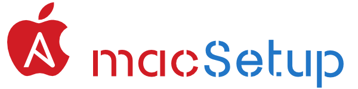

  

macSetup is an ansible playbook to automate macOS installation & configuration:
  * Add users, groups, and shell based on variables defined in [defaults.yml](group_vars_/all/defaults.yml), [host.yml](group_vars_/all/host.yml) and [secrets.yml](group_vars_/secrets.yml)
   * Install all [packages](group_vars_/all/packages.yml) via [homebrew](https://brew.sh), [Mac App Store command-line interface](https://github.com/mas-cli/mas) and downloaded installation files
 * Add printers
 * user preferences
    * activity Monitor
    * dock
    * file type association
    * finder
    * login components
    * photos
    * safari
    * spotlight
    * terminal
    * timeMachine

My objective is to work at the command line and automate so I don't have to document extensively.

## What problem does it solve and why is it useful?

You’ve been there too — setting up a new computer can be an ad-hoc, manual, and time-consuming process.

I wasn't happy with any of the automated setup that I came across. They were either overly complex or were missing features that I really wanted.

Refer to the [documentation folder](doc/how.md) and the code for more information. I'm not a fan of upgrading or the migration assistant as too much scruff from previously tested applications get carry over. I prefer a clean slate, complexity is the enemy of security.

## Pre requisites

1. Ensure that you have identified _all_ the applications on your current Mac and their sources such as [homebrew](https://brew.sh), [Mac App Store](https://github.com/mas-cli/mas) and downloaded installation files
2. Make sure that you have a copy of all the licensed files and keys required before you wipe it clean. Furthermore some applications require that you uninstall them or deallocate the licence.
3. Copy all your user preferences and settings using the backup playbook
 * backup.yml and restore.yml
   * Copy ...
## Installation

I'm currently using [Sonoma](https://www.apple.com/ca/macos/sonoma/), older macOS versions may work.

1. Boot the new Mac and answer a few questions:
    A. Language: English
    B. Country: Canada
    C. Accessibility: _not now_
    D. Migration Assistant: _not now_
2. Sign-in with your apple ID and accept the iCloud Terms & Conditions
3. Create a computer account
4. Install the developer tools (xcode) by opening terminal and typing `git`, the user interface will prompt you to download and install the command line developer tools
5. Clone the macSetup git repository on your Mac `git clone https://github.com/bhdicaire/macSetup` via terminal
6. Install homebrew and the required software components
  1. `cd macSetup`
  2. `make install`
7. Modify the configuration files with your preferred built-in text editor such as `vi`, don't worry the playbook will install [BBEdit](https://www.barebones.com/products/bbedit/) later
    * ./group_vars_/all/defaults.yml
    * ./(group_vars_/all/host.yml
    * ./group_vars_/secrets.yml
    * ./group_vars_/all/packages.yml
11. Go get a cup of coffee because you're NOT done, Vodka is also fine
12. Add and commit your macSetup configuration to a Git repository
13. The following tasks must be performed manually as I have yet to find a way to automate them:
    - [ ] Microsoft Office 2016
    - [ ] App Store - restore In-App Purchases for Marked2
    - [ ] [SetApp](https://setapp.com) applications
      * [Bartender](https://setapp.com/apps/bartender)
      * [Bike](https://setapp.com/apps/bike-outliner)
      * [BusyContact](https://setapp.com/apps/busycontacts)
      * [CleanShot X](https://setapp.com/apps/cleanshot)
      * [Forklift](https://setapp.com/apps/forklift)
      * [Gemini](https://setapp.com/apps/gemini)
      * [Hookmark](https://setapp.com/apps/hookmark)
      * [HoudahSpot](https://setapp.com/apps/houdahspot)
      * [iStat Menus](https://setapp.com/apps/istat-menus)
      * [Marked](https://setapp.com/apps/marked)
      * [Merlin Project Express](https://setapp.com/apps/merlin-project-express)
      * [OpenIN](https://setapp.com/apps/openin)
      * [PDF Squeezer](https://setapp.com/apps/pdf-squeezer)
      * [Permute](https://setapp.com/apps/permute)
      * [Pulltube](https://setapp.com/apps/pulltube)
      * [Souver](https://setapp.com/apps/soulver)

## Contributions

I'm really glad you're reading this, because I need help to *fully* automate macOS installation and configuration using Ansible. Please fork, fix, enhance, and send pull requests.

[Contributions](doc/CONTRIBUTING.md) are welcome! I recognize [all types](https://allcontributors.org/docs/en/emoji-key) based on the [all-contributors](https://github.com/all-contributors/all-contributors) specification. Please note that this project is released with a [Contributor Code of Conduct](doc/CODE-OF-CONDUCT.md). By participating in this project you agree to abide by its terms.

<!-- ALL-CONTRIBUTORS-LIST:START - Do not remove or modify this section -->
<!-- prettier-ignore-start -->
<!-- markdownlint-disable -->
<table>
  <tbody>
    <tr>
      <td align="center" valign="top" width="16.66%"><a href="https://github.com/bhdicaire"> <b>Benoît H. Dicaire</b></a> <a href="https://github.com/bhdicaire/vanityURLs/commits?author=bhdicaire" title="Code">💻</a> <a href="https://github.com/bhdicaire/vanityURLs/commits?author=bhdicaire" title="Documentation">📖</a> </td>
    </tr>
  </tbody>
</table>

<!-- markdownlint-restore -->
<!-- prettier-ignore-end -->

<!-- ALL-CONTRIBUTORS-LIST:END -->

## Related
 * [mac tools](https://github.com/bhdicaire/macTools) – Ansible roles for macOS automation

## Licence
**macSetup** is Copyright 2018 Benoît H. Dicaire and [licensed under the MIT licence](LICENCE).
